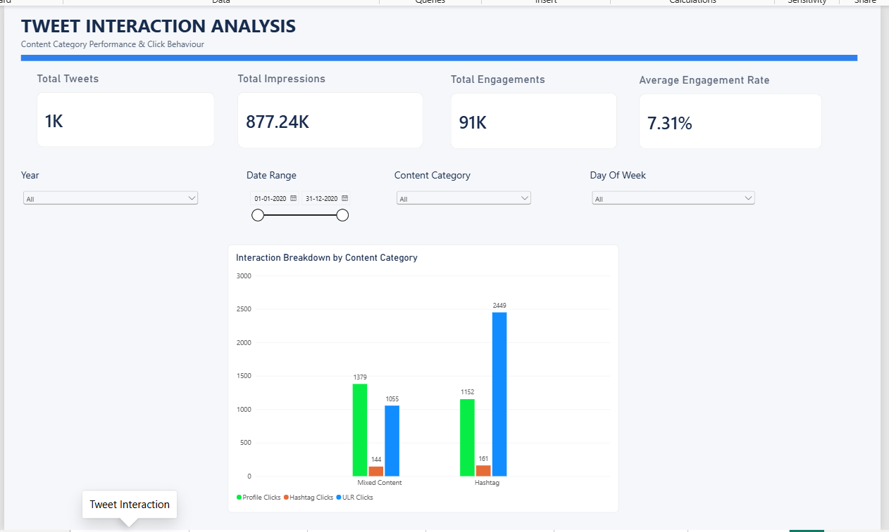
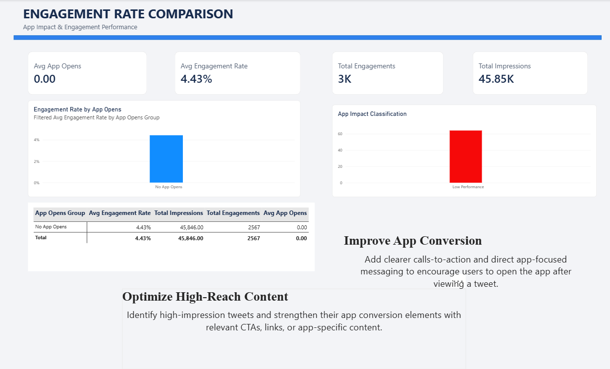
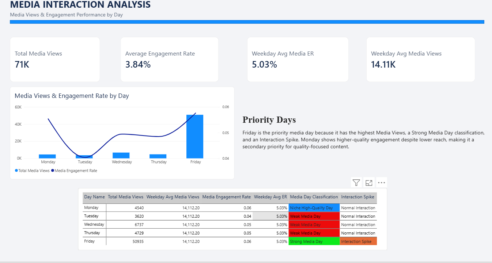
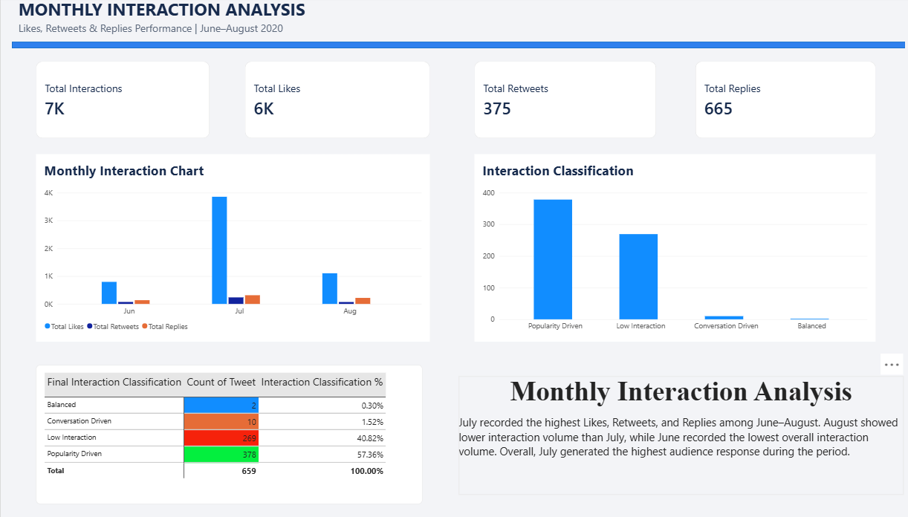
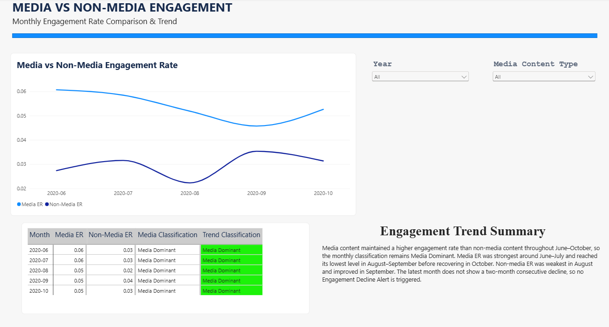
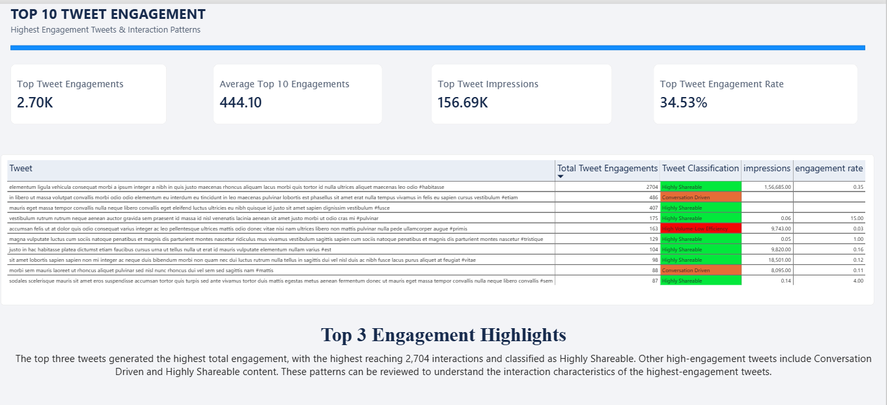

# 📊 Tweet Analytics Dashboard

An interactive **Tweet Analytics Dashboard** built using **Microsoft Power BI** to analyze tweet performance, engagement patterns, content behaviour, and audience interactions.

## 🚀 Project Overview

This project focuses on transforming social media data into meaningful insights through interactive dashboards and data analysis.

The dashboard analyzes tweet-level metrics such as impressions, engagements, likes, retweets, replies, media views, clicks, and engagement rates.

The project demonstrates practical skills in **data cleaning, data modeling, DAX, KPI development, visualization, and business-oriented data analysis**.

---

## 🎯 Objectives

- Analyze tweet engagement and interaction patterns
- Compare engagement performance across different content types
- Analyze media and non-media content performance
- Identify high-performing tweets
- Study daily and monthly engagement trends
- Create interactive and easy-to-understand Power BI dashboards
- Generate insights that can support social media performance analysis

---

## 🛠️ Tools & Technologies

- **Power BI**
- **DAX**
- **Power Query**
- **Microsoft Excel**
- **Data Visualization**
- **Data Analysis**
- **Data Modeling**

---

## 📑 Dashboard Pages

### 1. Tweet Interaction Analysis
Analyzes tweet interaction and click behaviour across different content categories.

Key metrics include:
- Total Tweets
- Total Impressions
- Total Engagements
- Engagement Rate
- URL Clicks
- Profile Clicks
- Hashtag Clicks

### 2. Engagement Rate Comparison
Compares engagement performance based on app-opening behaviour and identifies different engagement patterns.

### 3. Media Interaction Analysis
Analyzes media views and media engagement rates across weekdays.

### 4. Monthly Interaction Analysis
Compares:
- Likes
- Retweets
- Replies

across different months and classifies interaction behaviour.

### 5. Media vs Non-Media Analysis
Compares engagement rates between media and non-media content over time.

### 6. Top 10 Tweet Engagement
Identifies the top tweets based on total engagements and analyzes their interaction patterns.

---

## 📈 Key Features

- Interactive Power BI dashboards
- KPI cards
- Slicers and filters
- DAX-based calculations
- Time-based analysis
- Engagement classification
- Media vs non-media comparison
- Top-performing tweet analysis
- Conditional formatting
- Interactive tooltips
- Data-driven insights

---

## 🖼️ Dashboard Screenshots

### Tweet Interaction Analysis

### Engagement Rate Comparison

### Media Interaction Analysis

### Monthly Interaction Analysis

### Media vs Non-Media Analysis

### Top 10 Tweet Engagement

---

## 📊 Skills Demonstrated

- Data Cleaning
- Data Transformation
- Data Modeling
- DAX Measures
- Calculated Columns
- KPI Development
- Data Visualization
- Dashboard Design
- Time-Series Analysis
- Performance Analysis
- Business Insights

---

## 🔗 Live Dashboard

**Power BI Dashboard:**

https://app.powerbi.com/view?r=eyJrIjoiZmRkMTViY2UtMTM5OS00ODcwLTliYjgtY2ViMjAzMjM5YjNhIiwidCI6IjhiNDNlYmY2LWYwNGQtNGJiYi1hNDkwLTBiMDY2YmJlODMyZSJ9

---

## 📌 Project Outcome

The project demonstrates how social media data can be transformed into an interactive analytical dashboard using Power BI.

It provides a structured view of tweet performance, engagement behaviour, content performance, and high-performing tweets through interactive visualizations and DAX-based analysis.

---

## 👨‍💻 Author

**Purna Reddy**

B.Tech – Computer Science & Engineering (AI & ML)

Interested in **Data Analytics, Business Intelligence, Power BI, SQL, and Python**.
